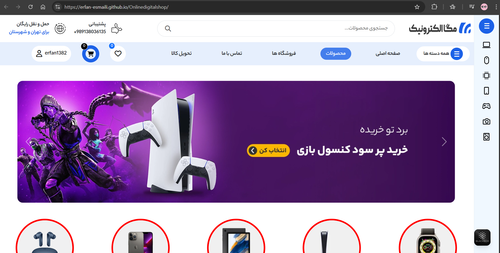
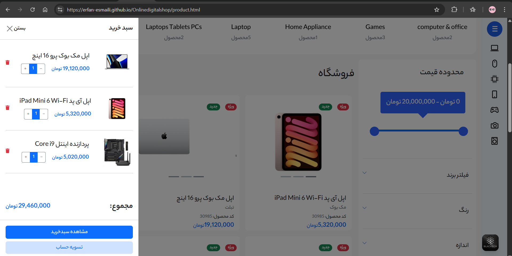
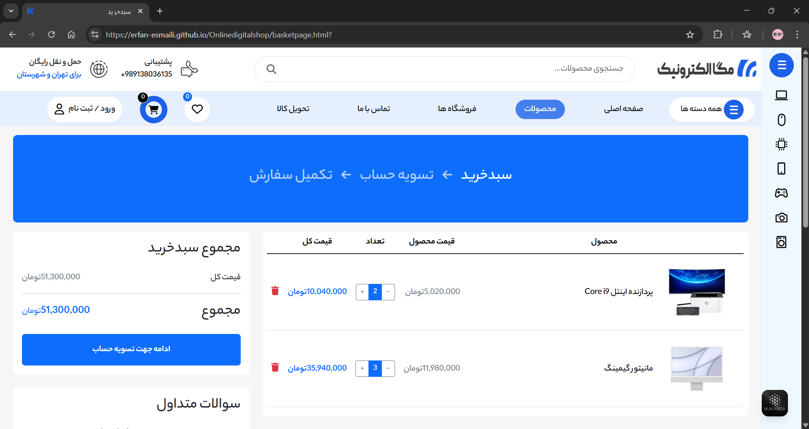
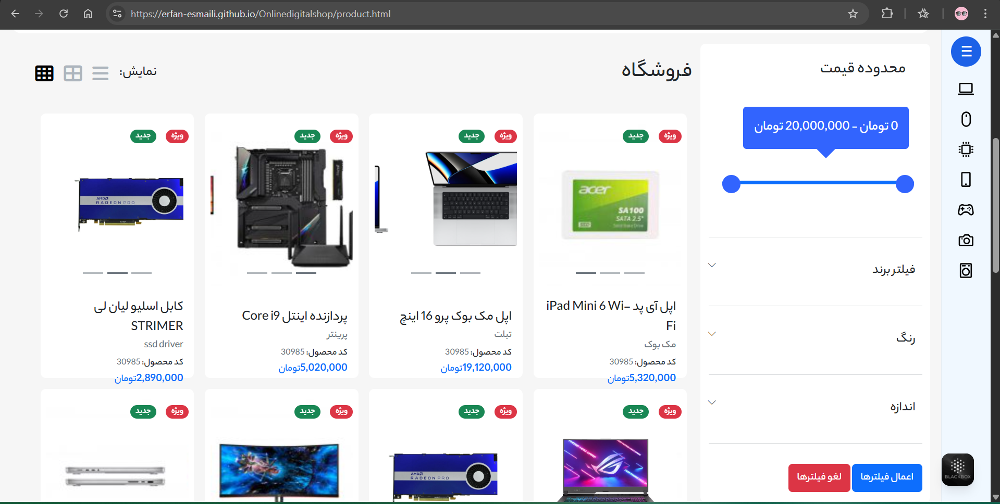
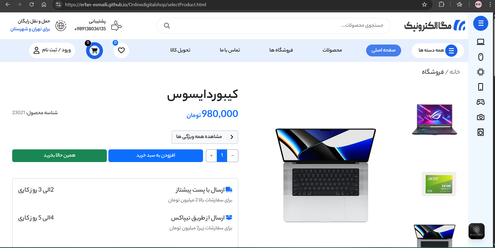
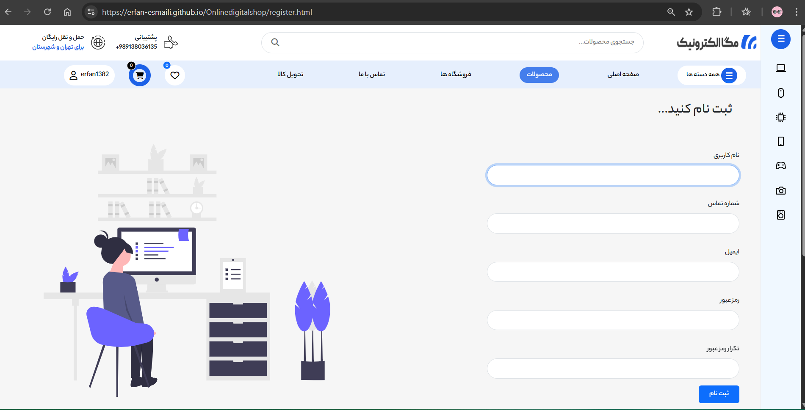

# 🛒 Online Digital Shop

> 🧩 **A project with:**
> 
> - Responsive design  
> - Modular architecture  
> - Component-based structure  
> - Scalability in mind  
> - Easy maintenance  
> - Compatibility across all devices

  
   

## 🧰 Used Languages

## 📦 Frameworks & Libraries

  
  
  
  

## 🛠 Tools

 

#  📷Screenshots

### 🏠 Homepage

 

### 🛒 Shopping Cart

 

 

### 🛍️ Product Page

 

 

 

### 📝 Signup Page

